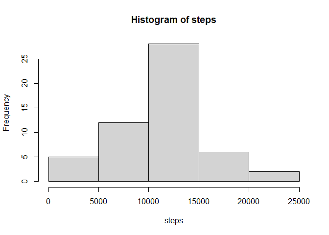
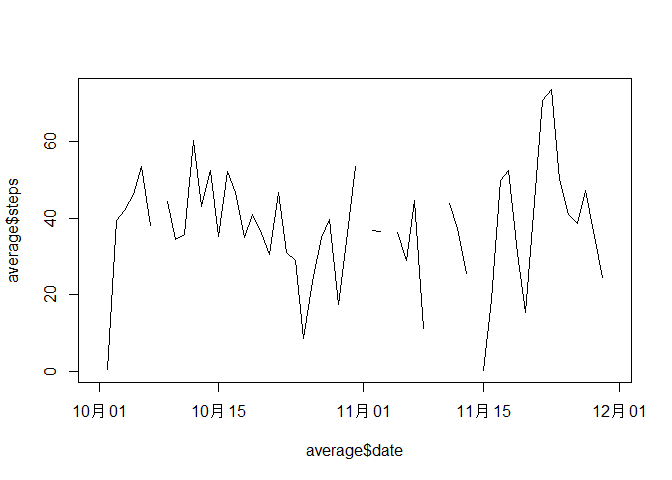
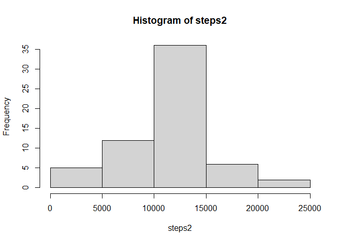
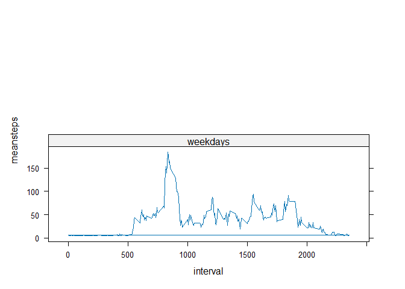

# Reproducible Research: Peer Assessment

## Loading and preprocessing the data


```r
data <- read.csv('activity.csv')
```

##Histogram of the total number of steps taken each


```r
steps <- tapply(data$steps, data$date, sum)
hist(steps)
```

<!-- -->

## mean and median number of steps taken per day


```r
mean(steps, na.rm=TRUE)
```

```
## [1] 10766.19
```

```r
median(steps, na.rm=TRUE)
```

```
## [1] 10765
```

## Time series plot of the average number of steps take


```r
library(lattice)
```

```
## Warning: package 'lattice' was built under R version 4.3.3
```

```r
average <- aggregate(data$steps, by=list(data$date), mean)
colnames(average) <- c("date", "steps")
average$date <- as.Date(average$date)
plot(average$date,average$steps, type="l")
```

<!-- -->

## The 5-minute interval that, on average, contains the maximum number of steps


```r
max(average$steps, na.rm=TRUE)
```

```
## [1] 73.59028
```

## Code to describe and show a strategy for imputing mission data


```r
sum(is.na(data))
```

```
## [1] 2304
```

```r
means <- mean(average$steps, na.rm=TRUE)
data[is.na(data)] <- means[col(data)][is.na(data)]
```

## Histogram of the total number of steps taken each day after missing values are imputed


```r
steps2 <- tapply(data$steps, data$date, sum)
hist(steps2)
```

<!-- -->

## Panel plot comparing the average number of steps taken per 5-minute interval across weekdays and weekends


```r
library(dplyr)
```

```
## Warning: package 'dplyr' was built under R version 4.3.3
```

```
## 
## Attaching package: 'dplyr'
```

```
## The following objects are masked from 'package:stats':
## 
##     filter, lag
```

```
## The following objects are masked from 'package:base':
## 
##     intersect, setdiff, setequal, union
```

```r
library(lattice)
library(lubridate)
```

```
## Warning: package 'lubridate' was built under R version 4.3.3
```

```
## 
## Attaching package: 'lubridate'
```

```
## The following objects are masked from 'package:base':
## 
##     date, intersect, setdiff, union
```

```r
data$date <- weekdays(lubridate::as_date(data$date))
data1 <- filter(data,date=="Saturday"|date=="Sunday")
data2 <- filter(data, date!="Saturday")
data3 <- filter(data2, date!="Sunday")
data1 <- mutate(data1, days="weekends")
data3 <- mutate(data3, days="weekdays")
newdata <- rbind(data1,data3)
newdata$meansteps <- tapply(newdata$steps, newdata$interval,mean)
xyplot(meansteps~interval|as.factor(days), data=newdata,type="l", layout=c(1,2))
```

<!-- -->
